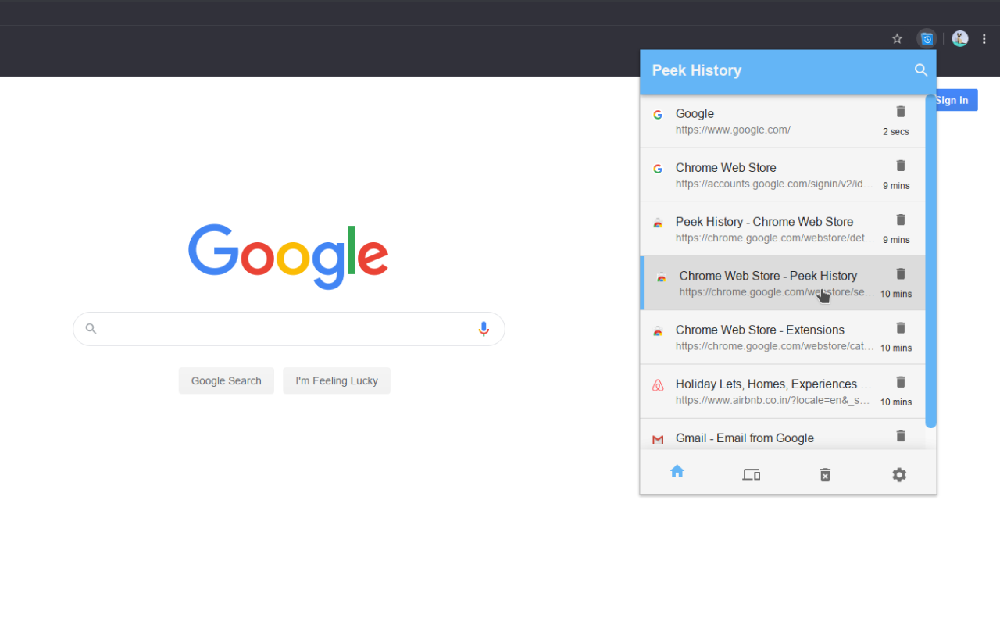
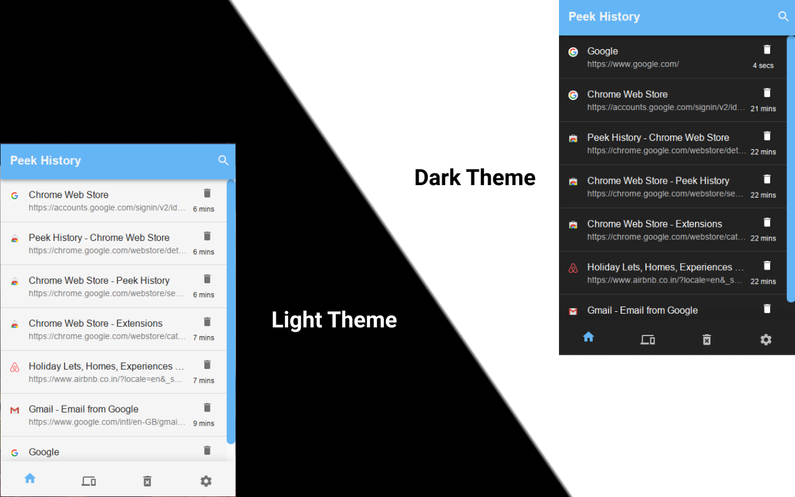
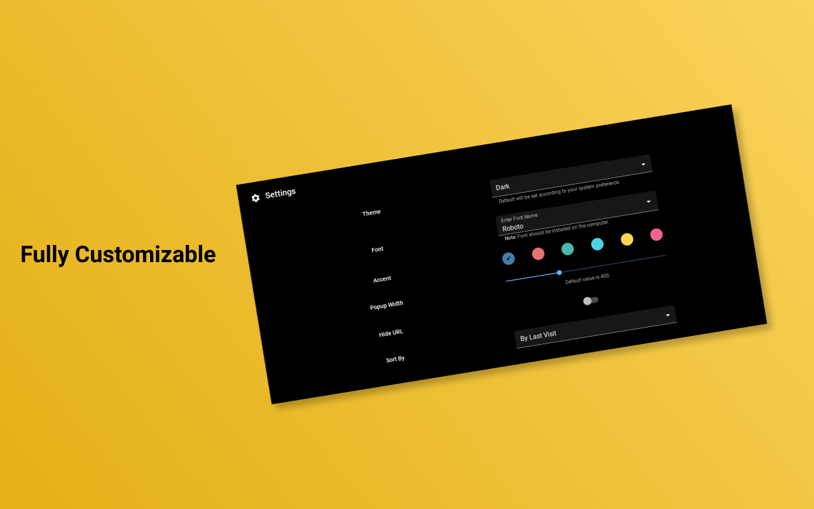

  

<h2 align="center">
  Peek History
</h2>

> #### A simple and minimal extension for quickly peeking and managing history.

This extension helps you to quickly peek history in the popup that helps you view, search, and delete your history without distracting you from your work. It also lets you restore your sessions across devices (Reopen recently closed tabs/windows or tabs/windows on other devices).

### :sparkles: Features

- Quickly peek history in popup
- Delete specific or all history
- Reopen closed tabs (Full session)
- Restore sessions from other devices
- Can be fully controlled with keyboard
- Infinite scrolling

### ⌨ Keyboard Shortcuts

- 🔵 Toggle peek history (Open/Close extension popup) - <kbd>Ctrl + Shift + H</kbd>
- 🔍 Quickly search in history - <kbd>Ctrl + S</kbd> (After opening popup)
- ⚙️ Open extension options/settings - <kbd>Ctrl + O</kbd> (After opening popup)
- 📑 See recently closed tabs/other tabs - <kbd>Ctrl + ➡️</kbd> Right Arrow (After opening popup)
- 🔢 After opening the popup you can use number keys <kbd>Ctrl + (1 - 9)</kbd> to open the nth number of history link or recently closed tab.

### Screenshots

---

---

 

  

